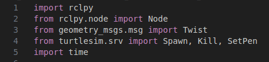
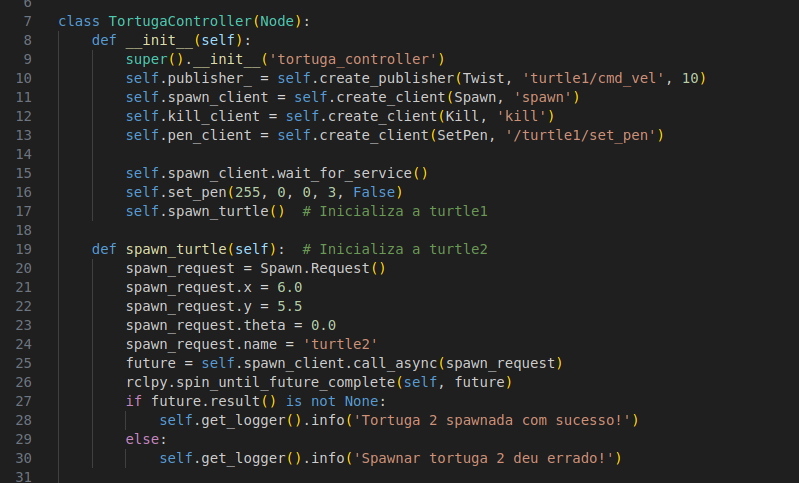
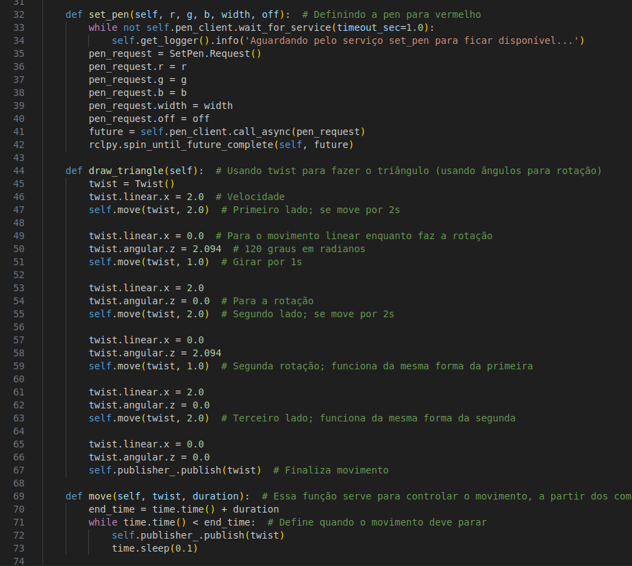
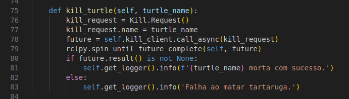
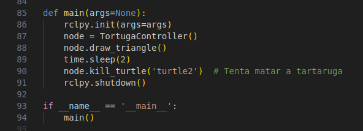

# Desenhando com Turtlesim
Atividade ponderada: criar um projeto ROS que interage com o a tartaruga do trutlesim, através de um script em Python. 

## Instruções para Execução
### Pré-requisitos
Ter os seguintes tecnologias instaladas localmentes:
- Python 3 ou superior;
- Turtlesim
- Ros2
  
Caso seja necessário instala-los, opte por seguir os passos indicados nesses links: 

[Instalando ROS](https://rmnicola.github.io/m6-ec-encontros/E01/ros) 

[Criando um Workspace](https://rmnicola.github.io/m6-ec-encontros/workspaces) 

### Execução
1. Clone esse repositório no seu computador. Para isso, você deve abrir o terminal, navegar até onde gostaria que o repositório fosse clonado e colar o seguinte comando:

   ```git clone https://github.com/cecigonca/ponderada-turtlesim.git```

2. Ainda em seu terminal, navegue até o diretório correto:

   ```Documentos/github/ponderada-turtlesim/```

3. Agora digite os seguinte comando para iniciar a tela da tartaruga:

     ```ros2 run turtlesim turtlesim_node```

4. Nessa etapa, você precisará abrir um segundo terminal, abrir o mesmo diretório e digitar os seguintes comandos:

    Comando para instalar as dependências necessárias: ```colcon build```
  
    Comando para configurar o ambiente de desenvolvimento ROS: ```source install/local_setup.bash```

    Comando para instanciar o código da pacote: ```ros2 run ponderada_cecilia ponderada```

## Vídeo do Projeto 
Para visualizar na prática, assista esse [vídeo](https://drive.google.com/file/d/1vlLJ1lKeuNU9FLW_KN2fCyBqclG5gmUQ/view?usp=sharing)

## Blocos de Código

### Importando Pacotes
Esta parte do código importa os pacotes e serviços necessários para controlar a simulação do Turtlesim e manipular tartarugas com o ROS 2.
- **import rclpy**: usado para inicializar e controlar os nós;
- **from rclpy.node import Node**: importa a classe básica para todos nós ROS 2;
- **from geometry_msgs.msg import Twist**: usada para controlar a velocidade e movimentação da tartaruga;
- **from turtlesim.srv import Spawn, Kill, SetPen**: pacotes turtlesim usados para gerenciar as tartarugas no ambiente;
- **import time**: módulo usado para funções relacionadas ao tempo.



### Primeira Seção
Nesta parte do código, a classe `TortugaController` é definida. 
- **set_pen**: define a cor da caneta da tartaruga;
- **spawn_turtle**: inicializa uma segunda tartaruga "turtle2";
- **draw_triangle**: comandos para desenhar o desenhar um triângulo;
- **move**: controla o movimento da tartaruga;
- **kill_turtle**: remove a segunda tartaruga do simulador.



### Segunda Seção 
Nesta parte do código, a função **set_pen** configura a caneta da tartaruga, enquanto **draw_triangle** desenha um triângulo movendo a tartaruga com rotações de 120 graus, e **move** controla o movimento da tartaruga por um tempo específico.

  

### Terceira Seção
Nesta parte do código, a função **kill_turtle** na classe **TortugaController** remove a "turtle2"m criando e enviando um pedido de remoção assíncrono. Se a remoção for bem-sucedida, uma mensagem de sucesso é registrada.

  

### Quarta Seção
Nesta parte do código, a função **main** inicializa um nó ROS 2, desenha um triângulo com a primeira tartaruga, tenta matar a segunda tartaruga e encerra o nó. O bloco **if __name__ == '__main__':** executa **main** se o script for executado diretamente.

  
